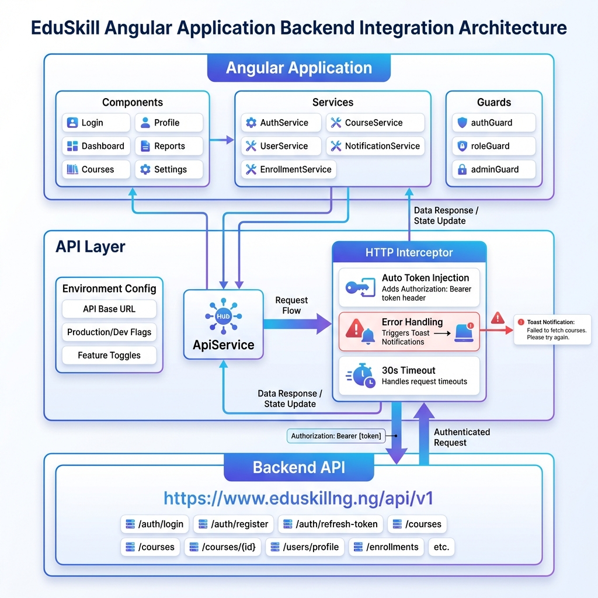

# 📚 Backend Integration Documentation Index

## 🎯 Start Here

**New to this setup?** Start with → [`SETUP_COMPLETE.md`](./SETUP_COMPLETE.md)

---

## 📖 Documentation Files

### 1. **SETUP_COMPLETE.md** ⭐ START HERE
Complete setup guide with:
- What was configured
- How it works
- Quick start instructions
- Usage examples
- Troubleshooting

### 2. **SECURE_STORAGE_SUMMARY.md** 🔐 SECURITY UPDATE
Secure storage implementation:
- Encrypted token storage
- Automatic token injection
- Smart endpoint detection
- Migration from localStorage
- **Read this for security details!**

### 3. **API_INTEGRATION.md** 📘 DETAILED GUIDE
Comprehensive API integration documentation:
- Environment configuration
- API service usage
- Authentication flow
- Error handling
- Code examples
- Best practices

### 4. **QUICK_REFERENCE.md** ⚡ CHEAT SHEET
Quick reference for common tasks:
- API calls syntax
- Authentication methods
- Route protection
- Build commands
- Common troubleshooting

### 5. **SECURE_STORAGE_GUIDE.md** 🔒 SECURITY GUIDE
Complete secure storage documentation:
- How encryption works
- Usage examples
- Security best practices
- Token refresh pattern
- Advanced options

### 6. **BACKEND_INTEGRATION_SUMMARY.md** 📊 OVERVIEW
High-level summary:
- Files created/modified
- Features implemented
- Configuration details
- Build status

### 7. **DEPLOYMENT_CHECKLIST.md** 🚀 DEPLOYMENT
Production deployment guide:
- Pre-deployment checklist
- Backend requirements
- Security checklist
- Deployment options (Netlify, Vercel, Firebase, nginx)
- Post-deployment testing
- Rollback plan

### 8. **.env.example** 🔧 CONFIGURATION
Template for environment variables

---

## 🗂️ Project Structure

```
EduSkill/
├── src/
│   ├── app/
│   │   ├── services/
│   │   │   ├── api.service.ts          ← Base API service
│   │   │   ├── api.interceptor.ts      ← HTTP interceptor
│   │   │   ├── auth.ts                 ← Auth service (updated)
│   │   │   └── auth-api.service.ts     ← Standalone auth example
│   │   ├── guards/
│   │   │   └── auth.guard.ts           ← Route guards
│   │   └── app.config.ts               ← App configuration (updated)
│   └── environments/
│       ├── environment.ts              ← Development config
│       └── environment.prod.ts         ← Production config
├── angular.json                        ← Build config (updated)
├── API_INTEGRATION.md                  ← Detailed docs
├── SETUP_COMPLETE.md                   ← Setup guide
├── QUICK_REFERENCE.md                  ← Quick reference
├── BACKEND_INTEGRATION_SUMMARY.md      ← Summary
├── DEPLOYMENT_CHECKLIST.md             ← Deployment guide
└── .env.example                        ← Env template
```

---

## 🚀 Quick Start (3 Steps)

### Step 1: Enable Real API
```typescript
// src/app/services/auth.ts (line 35)
private useMockAuth = false; // Set to false ✅
```

### Step 2: Test Locally
```bash
npm start
```

### Step 3: Build for Production
```bash
npm run build -- --configuration production
```

---

## 🔑 Key Features

✅ **API Service** - Centralized HTTP client  
✅ **HTTP Interceptor** - Auto auth headers & error handling  
✅ **Authentication** - Login/register with backend  
✅ **Route Guards** - Protect routes by auth/role  
✅ **Environment Config** - Dev/prod settings  
✅ **Error Handling** - User-friendly toast notifications  
✅ **Production Ready** - Optimized build configuration  

---

## 📝 Common Tasks

### Make an API Call
```typescript
this.apiService.get<Type>('/endpoint').subscribe(...)
```
**See:** [`QUICK_REFERENCE.md`](./QUICK_REFERENCE.md)

### Protect a Route
```typescript
canActivate: [authGuard]
```
**See:** [`API_INTEGRATION.md`](./API_INTEGRATION.md#protecting-routes)

### Handle Authentication
```typescript
this.authService.login(email, password, rememberMe).subscribe(...)
```
**See:** [`SETUP_COMPLETE.md`](./SETUP_COMPLETE.md#authentication-flow)

### Deploy to Production
**See:** [`DEPLOYMENT_CHECKLIST.md`](./DEPLOYMENT_CHECKLIST.md)

---

## 🎨 Architecture Diagram



The diagram shows:
- **Angular Application** → Components, Services, Guards
- **API Layer** → ApiService, HTTP Interceptor, Environment Config
- **Backend API** → https://www.eduskillng.ng/api/v1

---

## 🔧 Configuration

### API Base URL
```
https://www.eduskillng.ng/api/v1
```

### Environment Files
- **Development:** `src/environments/environment.ts`
- **Production:** `src/environments/environment.prod.ts`

### Toggle Mock/Real API
```typescript
// src/app/services/auth.ts
private useMockAuth = false; // false = real API
```

---

## 🐛 Troubleshooting

### CORS Errors
→ Check backend CORS configuration  
**See:** [`DEPLOYMENT_CHECKLIST.md`](./DEPLOYMENT_CHECKLIST.md#cors-configuration)

### 401 Unauthorized
→ Verify token validity  
**See:** [`QUICK_REFERENCE.md`](./QUICK_REFERENCE.md#troubleshooting)

### Build Errors
→ Check TypeScript interfaces match API responses  
**See:** [`API_INTEGRATION.md`](./API_INTEGRATION.md#troubleshooting)

---

## 📚 Additional Resources

- **Angular HttpClient:** https://angular.io/guide/http
- **RxJS Documentation:** https://rxjs.dev/
- **Backend API Docs:** https://www.eduskillng.ng/api/docs (if available)

---

## ✅ Status

- [x] Environment files created
- [x] API service implemented
- [x] HTTP interceptor configured
- [x] Authentication integrated
- [x] Route guards created
- [x] Error handling implemented
- [x] Production build tested ✅
- [x] Documentation complete

**Status:** ✅ **PRODUCTION READY**

---

## 🎉 You're All Set!

Your Angular application is fully configured for backend integration!

**Next Steps:**
1. Read [`SETUP_COMPLETE.md`](./SETUP_COMPLETE.md)
2. Enable real API (`useMockAuth = false`)
3. Test locally
4. Deploy using [`DEPLOYMENT_CHECKLIST.md`](./DEPLOYMENT_CHECKLIST.md)

---

**Questions?** Check the relevant documentation file above or contact your backend team.

**Created:** January 27, 2026  
**API URL:** https://www.eduskillng.ng/api/v1  
**Version:** 1.0.0
